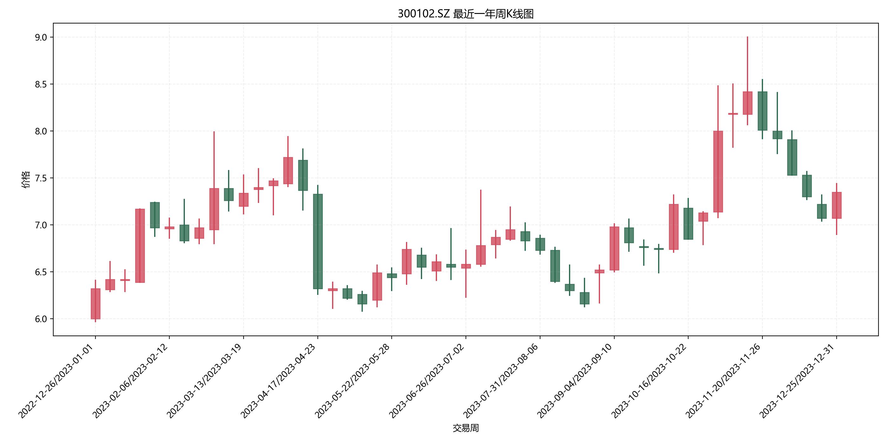
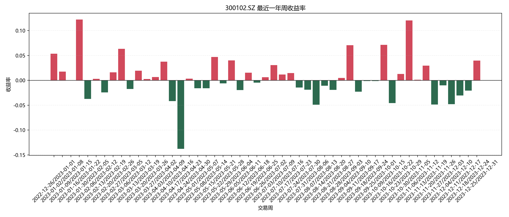
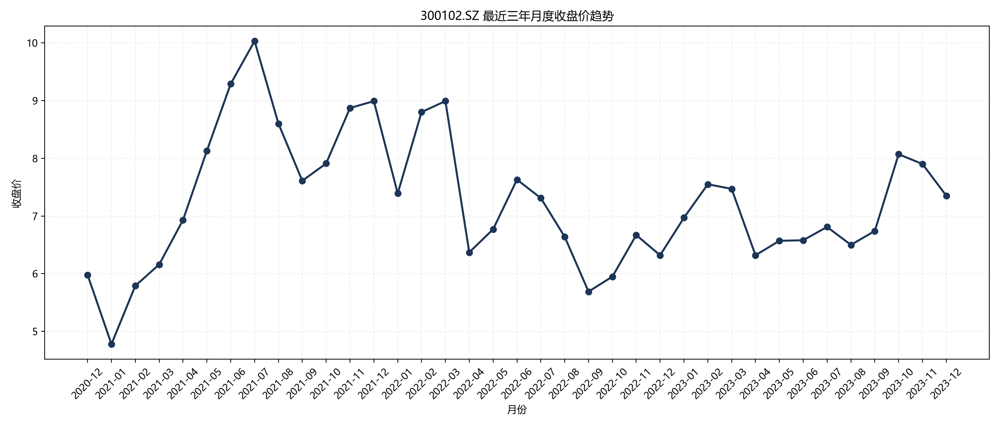
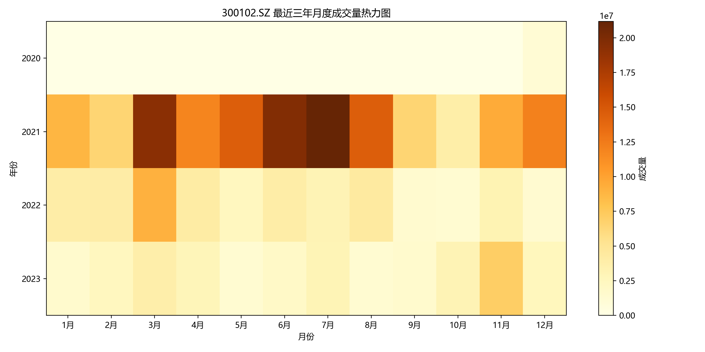
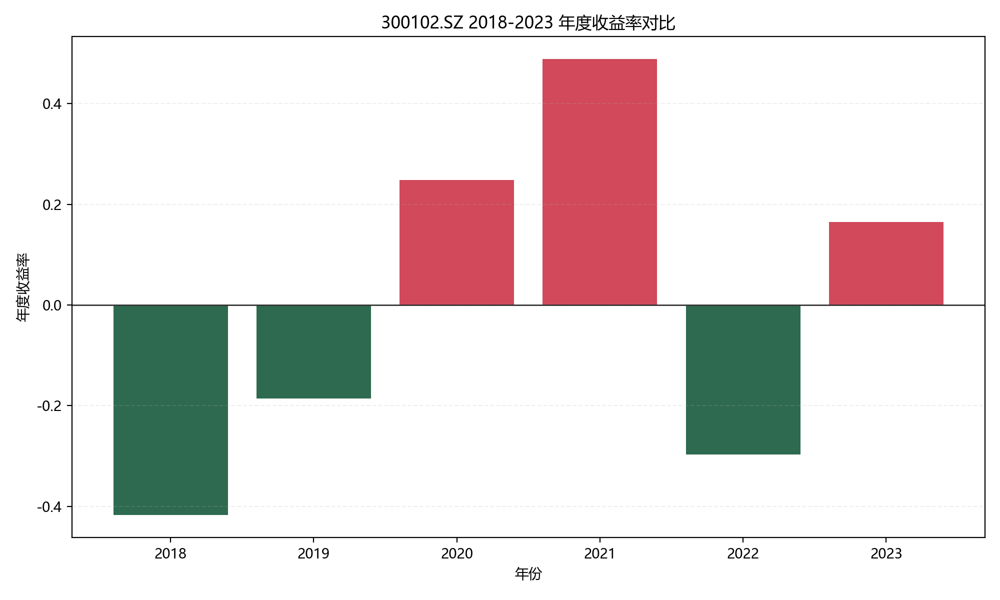
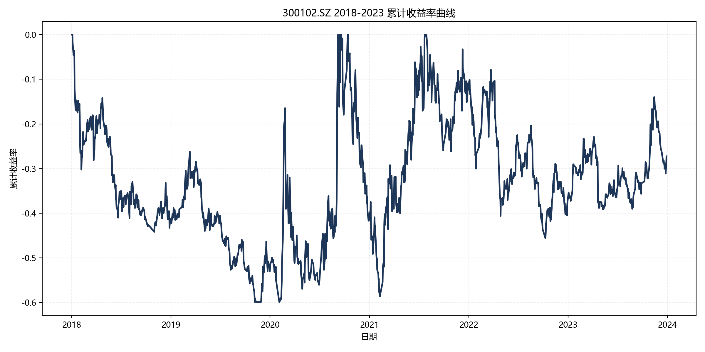

# 股票数据分析报告

## 1. 基本信息
- 股票代码：300102.SZ
- 股票名称：乾照光电
- 数据区间：20180101 - 20231231
- 日线记录数：1441

## 2. 数据预处理结论
- 通过插值、前向填充和后向填充处理了缺失值，避免关键价格字段为空。
- 对开盘价、最高价、最低价、收盘价、成交量和成交额做了 1% - 99% 分位数裁剪，用于减弱极端异常值影响。
- 新增了 `daily_return`、`ma5` 和 `volume_volatility` 三个衍生指标，并同步输出周、月、年三级聚合 CSV。

## 3. 周度分析
- 最近一年平均周收益率：0.39%
- 最近一年周收益率标准差：4.29%
- 价格振幅最大的 3 个交易周：
- 2023-10-30/2023-11-05：波动幅度 19.61%，周收益率 12.04%
- 2023-02-27/2023-03-05：波动幅度 17.12%，周收益率 6.33%
- 2023-04-17/2023-04-23：波动幅度 15.83%，周收益率 -13.78%

## 4. 月度分析
- 最近三年平均日成交量：281168.77
- 季节性表现最佳月份：2月
- 季节性表现最弱月份：4月

## 5. 年度分析
- 2018-2023 样本区间累计收益率：-27.24%
- 2018-2023 样本区间年化收益率：-5.17%
- 区间价格跨度：6.05

| year | open | close | annual_volatility | annual_return |
| --- | --- | --- | --- | --- |
| 2018 | 10.000000 | 5.830000 | 0.376306 | -0.417000 |
| 2019 | 5.830000 | 4.750000 | 0.360990 | -0.185249 |
| 2020 | 4.790000 | 5.980000 | 0.778162 | 0.248434 |
| 2021 | 6.040000 | 8.990000 | 0.622992 | 0.488411 |
| 2022 | 8.990000 | 6.320000 | 0.386041 | -0.296997 |
| 2023 | 6.310000 | 7.350000 | 0.328616 | 0.164818 |

## 6. 综合结论
1. 从周度数据看，该股票短周期收益率存在明显波动，适合结合风险偏好进行节奏控制。
2. 从月度季节性看，不同月份的收益表现差异较大，说明时间窗口对交易结果有显著影响。
3. 从年度趋势看，长期收益能力与年度波动率需要同时考察，不能仅凭单一年度涨跌下结论。

## 7. 投资建议
1. 若周收益率波动明显偏大，可采用分批建仓方式控制一次性买入风险。
2. 若历史上某些月份平均收益较弱，可在这些月份适当降低仓位或提高止损敏感度。
3. 若年度波动率上升但累计收益率没有同步改善，应优先考虑风险收益比，而不是只看绝对涨幅。

## 8. 说明
- 大盘指数相关性分析为选做项，当前版本未默认开启。
- 若你在实际运行后补充了股票名称、最终图表和口头分析，可直接将本报告作为提交材料的一部分。
